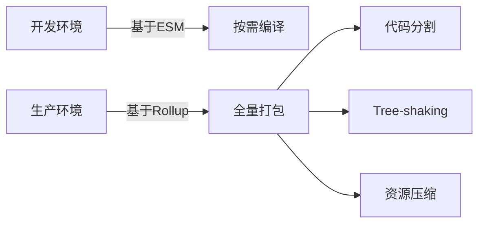

# Vite

## 原理

### 1. 开发服务器启动阶段

**与传统工具的本质区别**：
- Webpack等传统工具：必须完整打包所有模块才能启动开发服务器
- Vite：立即启动服务器，仅准备最基础运行时环境（如 `vite/client` 热更新逻辑）

**启动流程**：
1. 初始化HTTP服务器（约50ms）
2. 扫描项目入口文件（index.html）
3. 建立模块依赖图的骨架结构（不解析具体内容）

实现效果：无论项目大小，启动时间恒定在100-300ms

**冷启动优势**：
- 传统工具：O(n)复杂度（n=模块数量）
- Vite：O(1)复杂度

### 2. 浏览器请求处理阶段
**原生ES模块的工作流程**：
```
浏览器请求 index.html
  ↓
HTML中遇到 <script type="module" src="/src/main.js">
  ↓
浏览器发起对main.js的请求
  ↓
Vite实时转换JS文件（如TS→JS、Vue SFC编译）
  ↓
返回转换后代码，其中包含import语句
  ↓
浏览器继续发起对依赖模块的请求（循环此过程）
```

**关键优化点**：
- 按需编译：只编译当前页面实际用到的文件
- 依赖预构建：将CommonJS模块转换为ESM格式（存储在node_modules/.vite）
- 强缓存：未修改的源码返回304状态码
- 浏览器协作：利用浏览器原生模块解析能力，将部分工作转移给性能更强的现代浏览器，开发服务器只需做轻量级转换

### 3. 热更新（HMR）机制
**对比传统方案**：

Webpack和Vite在更新范围、更新时间和通信方式上存在显著差异。

Webpack需要更新整个bundle，其更新时间会随着项目规模线性增长；而Vite只需更新单个文件，更新时间恒定在50毫秒以内。在通信方式方面，Webpack使用WebSocket，Vite则结合了WebSocket和ETag技术。

**具体执行流程**：
1. 文件修改触发文件系统监听
2. Vite确定受影响模块范围
3. 通过WebSocket发送更新消息（包含新模块内容）
4. 浏览器直接替换ES模块实例

```javascript
// 传统工具需要重建整个依赖图
function rebuild() {
  const fullDependencyGraph = buildGraph();
  return bundle(fullDependencyGraph);
}

// Vite只需处理变更文件
function rebuild(file) {
  const affected = getAffectedModules(file);
  return partialUpdate(affected);
}
```

### 4. 生产构建策略
**开发与生产环境差异**：


**Rollup打包的优势**：
- 更高效的tree-shaking（相比webpack）
- 更简洁的bundle输出
- 更好的代码分割控制

## 构建

```ts :vite.config.ts
export default defineConfig({
  base: '/project/',
  server: {
    port: 3000,
    open: true
  },
  build: {
    outDir: 'dist',
    assetsInlineLimit: 4096
  }
})
```

```json :package.json
"scripts": {
  "dev": "vite",
  "build": "tsc && vite build -w"
}
```

### 开发模式 (`pnpm dev`)

1. **服务器启动流程**：
   - 解析项目配置（`vite.config.ts`）
   - 创建模块依赖图（Module Graph）
   - 启动 HTTP 服务器和 WebSocket 服务（用于 HMR）

2. **请求处理机制**：
   ```mermaid
   sequenceDiagram
   浏览器->>Vite 服务器: 请求 index.html
   Vite 服务器->>浏览器: 返回原始 HTML
   浏览器->>Vite 服务器: 请求 main.js
   Vite 服务器->>浏览器: 返回转换后的 JS
   浏览器->>Vite 服务器: 请求依赖模块
   Vite 服务器->>浏览器: 按需返回模块
   ```

3. **缓存策略**：
   - 预构建依赖（`node_modules`）会被缓存到 `node_modules/.vite`
   - 源码文件使用强缓存（Cache-Control: max-age=31536000）
   - 修改文件后通过 WebSocket 通知浏览器失效缓存

### 生产构建 (`pnpm build`)

1. **构建过程**：
   - 使用 Rollup 进行打包
   - 自动应用 tree-shaking 移除未使用代码
   - 支持多种输出格式（ESM、IIFE、UMD）
   - 构建完成后，`public` 目录下的内容会被复制到输出目录中

2. **代码分割策略**：
   - 动态导入（`import()`）自动创建单独 chunk
   - 支持手动配置 `manualChunks` 优化分包
   - CSS 自动提取到单独文件

3. **性能优化**：
   - 使用 `esbuild` 进行最小化（比 Terser 快 20-40 倍）
   - Brotli/Gzip 压缩支持
   - 支持异步 chunk 加载优化

4. **监听模式**：
   - 默认情况下，构建完成后不会持续监听文件变化
   - 添加 `-w` 参数（`pnpm build -w`）会启用持续监听并自动重新构建

## 环境变量

vite build 默认运行生产模式构建，也可以通过使用不同的模式和对应的 .env 文件配置来改变它，用以运行开发模式的构建。

- import.meta.env.DEV: 是否运行在开发环境(NODE_ENV=development)
- import.meta.env.PROD: 是否运行在生产环境(NODE_ENV=production)

1. **模式扩展**：
   ```js
   // vite.config.js
   export default defineConfig({
     define: {
       __APP_VERSION__: JSON.stringify(process.env.npm_package_version)
     }
   })
   ```

2. **智能类型提示**：
   创建 `src/env.d.ts` 获得类型提示：
   ```ts
   interface ImportMetaEnv {
     readonly VITE_API_URL: string
     readonly DEV: boolean
     readonly PROD: boolean
   }
   ```

3. **环境变量转换**：
   - 只有 `VITE_` 前缀的变量会暴露给客户端
   - 使用 `dotenv-expand` 支持变量扩展
   - 支持 `.env.local` 覆盖机制

## Rollup 代码分割

### 分包策略进阶

1. **自动分包算法**：
   ```js
   function autoChunk(id) {
     if (id.includes('node_modules')) {
       return 'vendor'
     }
     if (id.includes('src/utils')) {
       return 'utils'
     }
   }
   ```

2. **依赖分析优化**：
   - 使用 `rollup-plugin-visualizer` 分析包大小
   - 通过 `getModuleInfo` 获取模块引用关系
   - 动态调整 chunk 分割阈值

3. **解决循环依赖**：
   ```js
   function stableChunk(id, { getModuleInfo }) {
     const moduleInfo = getModuleInfo(id)
     if (moduleInfo.importers.some(imp => imp.isEntry)) {
       return 'main'
     }
   }
   ```

### 常见问题解决方案

1. **Chunk 碎片问题**：
   - 设置最小 chunk 大小阈值（如 10KB）
   - 合并常用工具函数到共享 chunk
   - 使用 `rollupOptions.output.minChunkSize` 配置

2. **循环引用报错**：
   ```js
   manualChunks(id, { getModuleInfo }) {
     if (id.includes('react')) return 'react'
     if (id.includes('lodash')) return 'lodash'
   }
   ```

3. **动态导入优化**：
   ```js
   // 使用 /* webpackChunkName: "name" */ 注释
   import(/* webpackChunkName: "chart" */ './chart')
   ```

## 性能优化

### 开发环境提速

1. **依赖预构建**：
   - 首次启动时自动执行
   - 将 CJS 模块转换为 ESM
   - 合并多个小文件减少请求

2. **配置优化**：
   ```js
   export default defineConfig({
     optimizeDeps: {
       include: ['lodash-es', 'axios']
     }
   })
   ```

3. **冷启动问题**：
   - 使用 `vite-plugin-optimize-persist` 持久化优化
   - 预配置常用依赖

### 生产环境优化

1. **异步加载优化**：
   ```js
   // vite.config.js
   export default defineConfig({
     build: {
       rollupOptions: {
         output: {
           manualChunks: {
             'react-vendor': ['react', 'react-dom'],
             'chart': ['echarts']
           }
         }
       }
     }
   })
   ```

2. **资源内联**：
   ```html
   <!-- 小图片转 base64 -->
   
   ```

3. **CDN 加速**：
   ```js
   export default defineConfig({
     build: {
       rollupOptions: {
         external: ['react'],
         output: {
           globals: {
             react: 'React'
           }
         }
       }
     }
   })
   ```

## Vite 3 → 4 版本迁移

升级步骤：

1. vite 安装 4 后，执行 pnpm i 查看相对应的 peer 依赖应该是多少。
2. 联动 peer 依赖更新，比如：vitejs/plugin-vue vitejs/plugin-vue-jsx unplugin-icons unplugins-element-plus
3. 测试页面

可以解决：
开发环境页面加载问题慢

出现的问题：
element-ui 下拉框组件出现异常，与 ui 版本有关。

element-plus el-select updateOptions emit 报错：`[Vue warn]: Extraneous non-emits event listeners (updatedcount) were passed to component but could not be automatically inherited because component renders fragment or text root nodes. If the listener is intended to be a component custom event listener only, declare it using the "emits" option`

目前解决：将 element-plus 降级到没有 updateOptions emit 即 2.2.32 恢复正常。还原相同环境测试 vue 相关的 emit 无问题，应该是 element-plus 问题，具体问题待确定。

```js
// 临时解决方案
import { ElSelect } from 'element-plus'
delete ElSelect.emits
```

### 常见问题排查

1. **HMR 失效**：
   - 检查 WebSocket 连接状态
   - 验证文件系统事件是否触发
   - 确保没有浏览器扩展干扰

2. **构建性能分析**：
   ```bash
   vite build --profile
   ```

3. **依赖解析问题**：
   ```js
   export default defineConfig({
     resolve: {
       alias: {
         '@': path.resolve(__dirname, 'src')
       }
     }
   })
   ```
